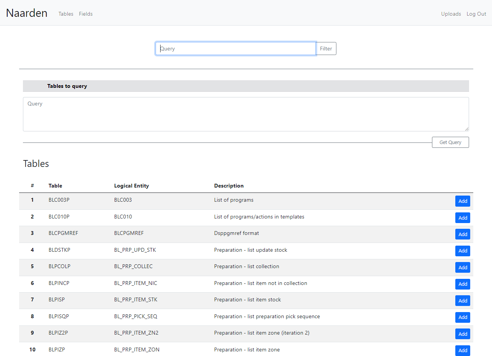

# Naarden Web App
Naarden is a web application that allows users to upload their own Relational Database Model to automatically generate a ready-to-use SQL query.

## Video Demo: ULR

## Background information
A relational database data is structured in tables that consist of columns and rows. Tables are linked to each other by means of primary keys and foreign keys. These links are called relationships. 
In big database, the Relational Database Model is seen as a huge network where tables are nodes and relationships are lines joining those nodes. This type of network is sometime called snowflake. 

Relational Database users sometimes have to join many tables in a single query to be able to get the desired data. This can be a laborious and time consuming work due to the high number of tables and relationships. Moreover, sometimes table and column names are not descriptive enough, which makes it even harder.

The Naarden web application is designed to help users to create SQL queries in a fast and ease way.

## Description
The Naarden application allows users to register by using a nickname, e-mail and password. After filling in the mandatory fields and if the registration process was done correctly, the user will be shown a successful message and will be redirected to the login page. Then, the Relational Database Model can be uploaded from the webpage section “Uploads”.  

The Relational Database Model is uploaded in three different JSON files. You can refer to /static folder to see an example of the Relational Database Model files.
At this point, the user can navigate through the different tables of the Relational Database Model. Each table shows the relevant information, such as columns name, description and data type.

The user can easily search for the desired Tables and Fields and click on the “Add” button to add them into the “Table to query” section. Once all your requested tables have been added, by pressing the “Get query” button the search algorithm is triggered in the backend, which will return an SQL query as a result. Please note that the generated query contains the best path possible (the shortest) between the requested tables.

Note that all Tables, Fields and Relationship data has to be uploaded upfront from the “Uploads” section.

## Technical information
The Naarden application is developed using Flask as the main framework (Python) and JavaScript, HTML and CSS in the frontend.

Database was managed using SQLAlchemy package. User data is stored in SQLite Database. 

## Files
- Templates folder

This folder contains the necessary HTML and Ninja code to render the following webpages: Index, Column, Tables, Upload, login and registration.

- init.py

This file contains the basic Flask configuration like; Database, session ...etc.

- forms.py

This file contains registration, login and upload forms from flask_wtf package. It also includes all the user input validations.

- models.py

This file contains Database Object Relational Mapper (SQLAlchemy). The Naarden web application uses the following tables: users, tables, columns and relationships. 

- view.py

This file contains all the different web routes. It also contains the necessary logic to handle the http request coming from the client side.

- webapp.py

This file contains all the necessary classes and methods that formed the search algorithm.

- naarden.db

SQLite database.

## Screen layouts

### Main webpage

### Registration

### Login

### File upload

### Tables

### Columns

### Get query

